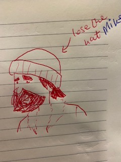

# Route around app.
An API-based route planner app. for runners and dog-walkers in London. :running: :runner:

```
                                    [Splash-page Image placeholder]
```
## Index
* [Installation](#Install)
* [User Stories](#User_Stories)
* [Usages](#Usages)
* [Tech Stack](#Tech_Stack)
* [Tests](#Jasmine)
* [Ceremonies](#Ceremonies)
* [Team](#Team)
* [Collaboration](#Collaboration)

## Quickstart
### Installation
First, clone this repository git@github.com:Fantastic-Makers-Group-2-final-Project/Route_Around.git Then:

## <a name="Install">Installation</a>
```
> npm install
```

## <a name="User_Stories">User stories:</a>
| Story 1 | Persona |
| :--- | ---:|
| `As a user super-fit Makers coach,`<br>`So I know how far I'm running,`<br>`I want to be able to pick a distance.`|  |

| Story 2 | Persona |
| :--- | ---:|
| `As a nature loving - yoga instructor,`<br>`So I can go for a run and come back home,`<br>`I want to be able to plan a circular route.`|  |

| Story 3 | Persona |
| :--- | ---:|
| `As a snazzy - dog walker,`<br>`So that I know I'm following my route,`<br>`I want to be able to track my location.`|  |

```
--- MVP (above) --
```
| Story 4 | Persona |
| :--- | ---:|
| `As a jazzy Makers coach,`<br>`So that I can wear appropriate clothing,`<br>`I want to know what the weather is/will be like.`|  |

| Story 5 | Persona |
| :--- | ---:|
| `As a super-chilled Makers coach,`<br>`So that I can eat or drink during my walk,`<br>`I want the option to see all cafes and restaurants within 500m of my location on the map.`|  |

```
--- nice to haves --
```
| Story 6 | Persona |
| :--- | ---:|
| `As a jazzy Makers coach,`<br>`So that I can choose how long I want to be out,`<br>`I want my route to be based on a time and speed that I choose.`|  |

| Story 7 | Persona |
| :--- | ---:|
| `As a nature loving - yoga instructor,`<br>`So that I can remember/celebrate the nice walk I took last week,`<br>`I want to be able to view my previous routes.`|  |

| Story 8 | Persona |
| :--- | ---:|
| `As a user super-fit Makers coach,`<br>`So that I can challenge my friends to compete,`<br>`I want to be able to view a leader-board.`|  |


## <a name="Usages">Usages</a>
### Choose Distance
```
[Image placeholder]
```
### Circular routes
```
[Image placeholder]
```
### Location tracking
```
[Image placeholder]
```
### Weather forecast
```
[Image placeholder]
```
### (via) Refreshment point(s)
```
[Image placeholder]
```

### <a name="Tech_Stack"> Tech Stack </a>
- React
- Node
- Java Script
- Google API
- Trello

## <a name="Jasmine">Tests</a>

## <a name="Ceremonies">Ceremonies</a>

### standup
Daily stand-ups were held at 09:30hrs at the whiteboard (Scrummaster role was rotated daily & pairs on a per task/sprint basis.)

### Work breakdown

### estimation
T-shirt sizing is used to our task estimation and reviewed post-sprint for effectiveness.

### reviews
Reviews are led by the day's Scrum-master post-sprint at the whiteboard.

### Demo
Demos are scheduled and pitched at the designated Product owners (coaches).

## <a name="Team"> Team:</a>

| <a href="http://fvcproductions.com" target="_blank">**Arjun**</a> | <a href="http://fvcproductions.com" target="_blank">**Elli**</a> | <a href="http://fvcproductions.com" target="_blank">**Alex**</a> | <a href="http://fvcproductions.com" target="_blank">**Ingrid**</a> | <a href="http://fvcproductions.com" target="_blank">**Robert**</a> | <a href="http://fvcproductions.com" target="_blank">**Kehinde**</a> |
| :---: |:---:| :---:| :---:| :---:| :---:|
| [](http://fvcproductions.com)    | [](http://fvcproductions.com) | [](http://fvcproductions.com)  | [](http://fvcproductions.com)  | [](http://fvcproductions.com)  | [](http://fvcproductions.com)  |
| <a href="https://github.com/ac4059" target="_blank">`github.com/ac4059`</a> | <a href="https://github.com/eliseaston" target="_blank">`github.com/eliseaston`</a> | <a href="https://github.com/Clifford2910" target="_blank">`github.com/Clifford2910`</a> | <a href="https://github.com/ingridbjarman" target="_blank">`github.com/ingridbjarman`</a> | <a href="https://github.com/robertwoolley99" target="_blank">`github.com/robertwoolley99`</a> | <a href="https://github.com/KOlofinmoyin" target="_blank">`github.com/KOlofinmoyin`</a>

### Collaboration:
1. Our card wall is here: https://trello.com/b/m2WH1cSw/fantastic-makers-group-2-final-project
2. Read blogposts of our adventures as a team at: https://medium.com/series/dac42574577d/edit

This project was bootstrapped with [Create React App](https://github.com/facebook/create-react-app).

## Available Scripts

In the project directory, you can run:

### `yarn start`

Runs the app in the development mode.<br />
Open [http://localhost:3000](http://localhost:3000) to view it in the browser.

The page will reload if you make edits.<br />
You will also see any lint errors in the console.

### `yarn test`

Launches the test runner in the interactive watch mode.<br />
See the section about [running tests](https://facebook.github.io/create-react-app/docs/running-tests) for more information.

### `yarn build`

Builds the app for production to the `build` folder.<br />
It correctly bundles React in production mode and optimizes the build for the best performance.

The build is minified and the filenames include the hashes.<br />
Your app is ready to be deployed!

See the section about [deployment](https://facebook.github.io/create-react-app/docs/deployment) for more information.

### `yarn eject`

**Note: this is a one-way operation. Once you `eject`, you can’t go back!**

If you aren’t satisfied with the build tool and configuration choices, you can `eject` at any time. This command will remove the single build dependency from your project.

Instead, it will copy all the configuration files and the transitive dependencies (Webpack, Babel, ESLint, etc) right into your project so you have full control over them. All of the commands except `eject` will still work, but they will point to the copied scripts so you can tweak them. At this point you’re on your own.

You don’t have to ever use `eject`. The curated feature set is suitable for small and middle deployments, and you shouldn’t feel obligated to use this feature. However we understand that this tool wouldn’t be useful if you couldn’t customize it when you are ready for it.

## Learn More

You can learn more in the [Create React App documentation](https://facebook.github.io/create-react-app/docs/getting-started).

To learn React, check out the [React documentation](https://reactjs.org/).

### Code Splitting

This section has moved here: https://facebook.github.io/create-react-app/docs/code-splitting

### Analyzing the Bundle Size

This section has moved here: https://facebook.github.io/create-react-app/docs/analyzing-the-bundle-size

### Making a Progressive Web App

This section has moved here: https://facebook.github.io/create-react-app/docs/making-a-progressive-web-app

### Advanced Configuration

This section has moved here: https://facebook.github.io/create-react-app/docs/advanced-configuration

### Deployment

This section has moved here: https://facebook.github.io/create-react-app/docs/deployment

### `yarn build` fails to minify

This section has moved here: https://facebook.github.io/create-react-app/docs/troubleshooting#npm-run-build-fails-to-minify
