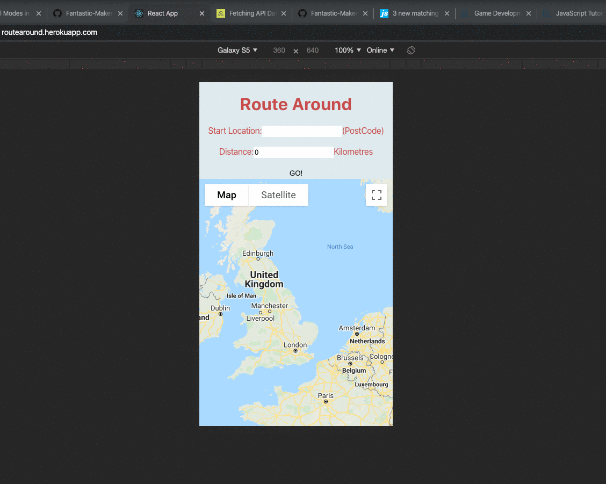

# Route around app.
An API-based route planner app. for runners and dog-walkers in London. :running: :runner:
<p align="center">
  
</p>


## Index
* [Installation](#Install)
* [Endpoints](#Endpoints)
* [User Stories](#User_Stories)
* [Usages](#Usages)
* [Tech Stack](#Tech_Stack)
* [Tests](#Jasmine)
* [Ceremonies](#Ceremonies)
* [Team](#Team)
* [Collaboration](#Collaboration)

## Quickstart
### Installation
First, clone this repository git@github.com:Fantastic-Makers-Group-2-final-Project/Route_Around.git Then:

## <a name="Install">Installation</a>
To install all dependencies, run
```
> npm install
```
To start the web server, run
```
> npm start
```

## <a name="Endpoints">Endpoints</a>
| Endpoint | Request Method | Example Payload | Description |
|---|---|---|---|
| `/heartbeat` | `GET` | n/a | For checking the status of the server. |
| `/generate-waypoint-coordinates` | `POST` | `{"coordinates":{"lat": 51.4947, "lng": 0.0774}, "distance": 5}` | Returns the Lat/Lng coordinates of the generated waypoints. Expects the Content-Type Header to be set to JSON. |

## <a name="User_Stories">User stories:</a>
| Story 1 |
| :--- |
| `As a user super-fit Makers coach,`<br>`So I know how far I'm running,`<br>`I want to be able to pick a distance.`|

| Story 2 |
| :--- |
| `As a nature loving - yoga instructor,`<br>`So I can go for a run and come back home,`<br>`I want to be able to plan a circular route.`|

| Story 3 |
| :--- |
| `As a snazzy - dog walker,`<br>`So that I know I'm following my route,`<br>`I want to be able to track my location.`|

```
--- MVP (above) --
```
| Story 4 |
| :--- |
| `As a jazzy Makers coach,`<br>`So that I can wear appropriate clothing,`<br>`I want to know what the weather is/will be like.`|

| Story 5 |
| :--- |
| `As a super-chilled Makers coach,`<br>`So that I can eat or drink during my walk,`<br>`I want the option to see all cafes and restaurants within 500m of my location on the map.`|

```
--- nice to haves --
```
| Story 6 |
| :--- |
| `As a jazzy Makers coach,`<br>`So that I can choose how long I want to be out,`<br>`I want my route to be based on a time and speed that I choose.`|

| Story 7 |
| :--- |
| `As a nature loving - yoga instructor,`<br>`So that I can remember/celebrate the nice walk I took last week,`<br>`I want to be able to view my previous routes.`|

| Story 8 |
| :--- |
| `As a user super-fit Makers coach,`<br>`So that I can challenge my friends to compete,`<br>`I want to be able to view a leader-board.`|


## <a name="Usages">Usages</a>
### Choose Distance
```
[Image placeholder]
```
### Circular routes
```
[Image placeholder]
```
### Location tracking
```
[Image placeholder]
```
### Weather forecast
```
[Image placeholder]
```
### (via) Refreshment point(s)
```
[Image placeholder]
```

### <a name="Tech_Stack"> Tech Stack </a>
- React
- Node
- Java Script
- Google API
- Trello

## <a name="Jasmine">Tests</a>

## <a name="Ceremonies">Ceremonies</a>

### standup
Daily stand-ups were held at 09:30hrs at the whiteboard (Scrummaster role was rotated daily & pairs on a per task/sprint basis.)

### Work breakdown

### estimation
T-shirt sizing is used to our task estimation and reviewed post-sprint for effectiveness.

### reviews
Reviews are led by the day's Scrum-master post-sprint at the whiteboard.

### Demo
Demos are scheduled and pitched at the designated Product owners (coaches).

## <a name="Team"> Team:</a>

| <a href="http://fvcproductions.com" target="_blank">**Arjun**</a> | <a href="http://fvcproductions.com" target="_blank">**Ellie**</a> | <a href="http://fvcproductions.com" target="_blank">**Alex**</a> | <a href="http://fvcproductions.com" target="_blank">**Ingrid**</a> | <a href="http://fvcproductions.com" target="_blank">**Robert**</a> | <a href="http://fvcproductions.com" target="_blank">**Kehinde**</a> |
| :---: |:---:| :---:| :---:| :---:| :---:|
| [](http://fvcproductions.com)    | [](http://fvcproductions.com) | [](http://fvcproductions.com)  | [](http://fvcproductions.com)  | [](http://fvcproductions.com)  | [](http://fvcproductions.com)  |
| <a href="https://github.com/ac4059" target="_blank">`github.com/ac4059`</a> | <a href="https://github.com/eliseaston" target="_blank">`github.com/eliseaston`</a> | <a href="https://github.com/Clifford2910" target="_blank">`github.com/Clifford2910`</a> | <a href="https://github.com/ingridbjarman" target="_blank">`github.com/ingridbjarman`</a> | <a href="https://github.com/robertwoolley99" target="_blank">`github.com/robertwoolley99`</a> | <a href="https://github.com/KOlofinmoyin" target="_blank">`github.com/KOlofinmoyin`</a>

### Collaboration:
1. Our card wall is here: https://trello.com/b/m2WH1cSw/fantastic-makers-group-2-final-project
2. Read blogposts of our adventures as a team at: https://medium.com/series/dac42574577d/edit
